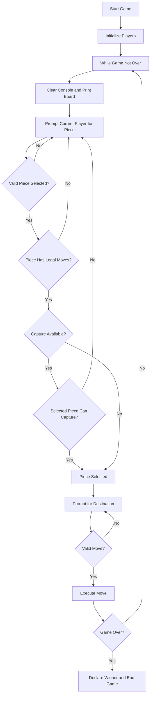
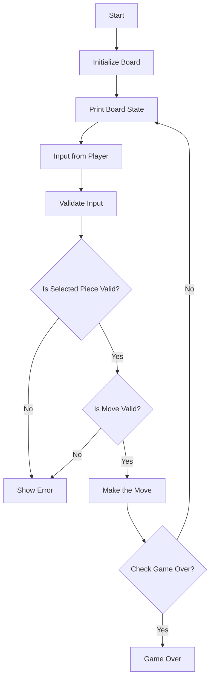

# System Documentation: Dama Ethiopian Checkers Game

## 1. System Overview
### **`General Description`**: 
a traditional Ethiopian Checkers game, Dama, is designed for offline, local multiplayer play.

**`Setup`**: The game is played on an 8x8 board with alternating dark and light squares (a 8x8 grid or matrix/2d array). Each player starts with 12 pieces, placed on the dark squares in their respective half of the board.

**`Turns`**: Players take turns moving their pieces diagonally forward across the dark squares.

**`Capturing`**: Players can jump over an opponent’s piece to capture it if the square beyond is empty. Capturing is mandatory if a capture move is available.

**`King Promotion`**: When a piece reaches the opponent’s back row, it is promoted to a King. Kings can move diagonally forwards and backward, offering more strategic options.

**`Winning the Game`**: The game ends when a player captures all of their opponent’s pieces or blocks them from making any legal moves.
## 2. Functional Requirements

### Core Requirements:
- Two players can play the game.
- Players can move pieces diagonally.
- Players can capture opponent pieces by jumping over them.
- Pieces can be promoted to kings when reaching the opposite end.
- Kings can move both forward and backward.
- Mandatory capture rules are enforced.
- Game ends when a player loses all pieces or has no valid moves.

### Player Interaction Requirements:
- Players can input their names.
- Players can select pieces using the coordinate system.
- Players can select destination moves.
- Players can view the current game state.
- Players receive feedback on invalid moves.

## 3. Non-Functional Requirements

### Performance:
- Instant response to player moves.
- Efficient board state validation.

### Usability:
- Clear board visualization.
- Intuitive coordinate input system.
- Informative error messages.

### Reliability:
- Input validation.
- Game state consistency.
- Thread-safe player management By using a concurrent HashMap.It allows for a multiple access without corrapting the data

### Maintainability:
- Modular design.
- Clear separation of concerns.
- Well-documented code.

## 4. Class Diagram

### Main Class

```
[Main]
├── Fields:
│   ├── SIZE: int
│   ├── board: char[][]
│   ├── player1Turn: boolean
│   ├── players: ConcurrentHashMap
│   ├── gameRunning: AtomicBoolean
│   ├── player1Pieces: int
│   └── player2Pieces: int
│
├── Inner Classes:
│   └── [Player]
│       ├── name: String
│       ├── symbol: char
│       └── kingSymbol: char
│
├── Game Logic Methods:
│   ├── initializeBoard()
│   ├── printBoard()
│   ├── makeMove()
│   ├── isValidMove()
│   └── isGameOver()
│
└── Helper Methods:
    ├── parseInput()
    ├── isValidPiece()
    ├── hasLegalMoves()
    └── hasCaptureMoves()
```

# Inheritance Structure:

# Player Class Hierarchy

## Abstract Class: `Player`
The `Player` class serves as an abstract base for defining common functionality and attributes shared by all players in the game.

### Attributes:
- `name` (String): The name of the player.
- `symbol` (char): The character symbol representing the player's regular pieces.
- `kingSymbol` (char): The character symbol representing the player's king pieces.

### Core Methods:
- `makeMove()`: Abstract method to define how a player makes a move.
- `getAvailableMoves()`: Retrieves all possible moves for the player.
- `promotePiece()`: Promotes a piece to a king when conditions are met.

---

## Class Hierarchy

### `Player1`
A concrete implementation of the `Player` class, representing Player 1.

- **Attributes**:
  - `name`: Name of Player 1.
  - `symbol`: 'O' (used for Player 1's regular pieces).
  - `kingSymbol`: 'K' (used for Player 1's king pieces).

- **Special Characteristics**:
  - Regular pieces are represented as `Player1Piece`.
  - Promoted pieces are represented as `Player1King`.

---

### `Player2`
A concrete implementation of the `Player` class, representing Player 2.

- **Attributes**:
  - `name`: Name of Player 2.
  - `symbol`: 'X' (used for Player 2's regular pieces).
  - `kingSymbol`: 'Q' (used for Player 2's king pieces).

- **Special Characteristics**:
  - Regular pieces are represented as `Player2Piece`.
  - Promoted pieces are represented as `Player2King`.

---

## Relationship with Pieces
The `Player` class interacts closely with the `Piece` hierarchy to manage game logic:

```
GameObject
└── Piece
    ├── RegularPiece
    │   ├── Player1Piece (O)
    │   └── Player2Piece (X)
    └── KingPiece
        ├── Player1King (K)
        └── Player2King (Q)
```

### Key Interactions:
- Players own pieces (`Player1` owns `Player1Piece` and `Player1King`; `Player2` owns `Player2Piece` and `Player2King`).
- Players are responsible for moving their pieces and promoting them to kings when they reach the opposite end of the board.




